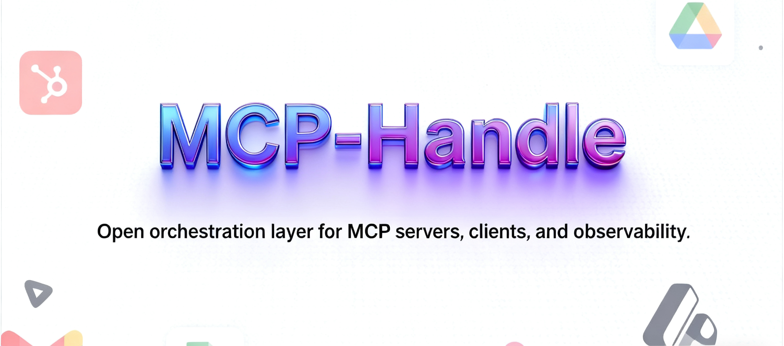

# MCP-Handle by 低温宝

<div align="center">
  <picture>
    
  </picture>
</div>

<div align="center">

[](https://www.mcp-handle.com/docs) [](https://www.mcp-handle.com) [](https://discord.gg/p7TuTEcson)

  
  
</div>

---

## Why MCP-Handle

- **Orchestrate agent tooling** with Strata, our progressive MCP router that keeps function calling under control.
- **Run more than one hundred first-party MCP servers** (OAuth-ready where it matters) straight from the repository.
- **Instrument and monitor every deployment** by embedding the new MCP Handle Status service (adapted from an open-source dashboard by JustSong) for rich health and analytics insights.
- **Ship clients quickly** through ready-to-run Discord, Slack, WhatsApp, CLI, and web MCP clients.

---

## At a Glance

- **Strata MCP router** – dynamic orchestration so agents only see the tools they need when they need them (`open-strata/`).
- **MCP server catalog** – >100 integrations spanning SaaS, data, comms, and infra (`mcp_servers/`).
- **Multi-channel MCP clients** – production-grade bots powered by the official MCP SDK (`mcp-clients/`).
- **MCP Handle Status** – embedded status center with Go/React backend+frontend (`mcp_handle_status/`).
- **Docs & guides** – comprehensive Mintlify docs rewired for the new brand (`docs/`).

```
workspace/
├── docs/                    # Mintlify documentation, API reference, and tutorials
├── mcp_servers/             # First-party MCP server implementations
├── mcp-clients/             # Discord, Slack, Web, WhatsApp MCP clients
├── open-strata/             # Progressive MCP orchestration engine
├── mcp_handle_status/       # New status & analytics dashboard (Go + React)
├── scripts/                 # Helper scripts (e.g., start_status_service.sh)
└── NOTICE, LICENSE          # Apache-2.0 root license + third-party attributions
```

---

## Quickstart

1. **Install prerequisites**
   - Python 3.12+
   - Node.js 18+
   - Go 1.20+
   - Docker (optional but recommended)

2. **Clone the repository**

   ```bash
   git clone https://github.com/WeatherPal-AI/MCP-handle.git
   cd MCP-handle
   ```

3. **Install dependencies (optional selective steps)**
   ```bash
   # Install Strata CLI
   cd open-strata
   uv pip install -r requirements.txt  # or your preferred tool
   cd ..

   # Bootstrap client dependencies (example: Discord bot)
   cd mcp-clients
   uv sync
   cd ..
   ```

4. **Launch Strata locally**

   ```bash
   cd open-strata
   uv run strata --help
   ```

5. **Run the MCP Handle Status dashboard**

   ```bash
   ./scripts/start_status_service.sh
   # Frontend dev server : http://localhost:5173
   # API & dashboard     : http://localhost:3000
   ```

   The helper script creates a default `.env`, builds the React frontend, and boots the Go backend. Logs are written to `mcp_handle_status/backend.log`.

---

## Working with MCP Servers

- Every server lives under `mcp_servers/<integration>` with language-specific tooling.
- OAuth-capable servers consume the `_oauth_support/` helpers and respect the new `MCP_HANDLE_*` environment variables.
- Docker images and package metadata now point to the WeatherPal-AI namespace (`ghcr.io/weatherpal-ai/...`, `@weatherpal-ai/...`).
- Example recipes in `examples/` map directly to the new Python (`mcp_handle`) and TypeScript packages.

```bash
# Example: run the GitHub MCP server in watch mode
cd mcp_servers/github
go run ./...
```

---

## Observability with MCP Handle Status

The integrated status service replaces the proprietary dashboards from the original project.

- **Live health checks** for stdio, SSE, and streamable HTTP servers.
- **Installation manager** with npm/PyPI bootstrap flows.
- **Analytics** (usage, latency, failure modes) backed by SQLite out-of-the-box.

Key commands:

```bash
# Build the dashboard container
cd mcp_handle_status
docker build -t weatherpal-ai/mcp-handle-status .

# Run natively (already done by the helper script)
./run.sh
```

---

## Contributing

- Fork, branch, and submit PRs targeting `main`.
- Keep code comments concise and add tests where behaviour changes.
- If you extend third-party code (e.g., the MCP Handle Status component), preserve upstream attribution in `NOTICE` and the component’s local LICENSE.

---

## License & Governance

- **Root license:** Apache-2.0 (see `LICENSE`).
- **Embedded code:** MIT-licensed portions sourced from an open project by JustSong remain under MIT inside `mcp_handle_status/`.
- **Maintainer:** WeatherPal-AI（低温宝） (service@diwenbao.co)(mailto:service@diwenbao.co)

Open issues and roadmap items are tracked in the GitHub repository. Join the discussion, file feature requests, and help the MCP ecosystem stay open and agent-friendly.
