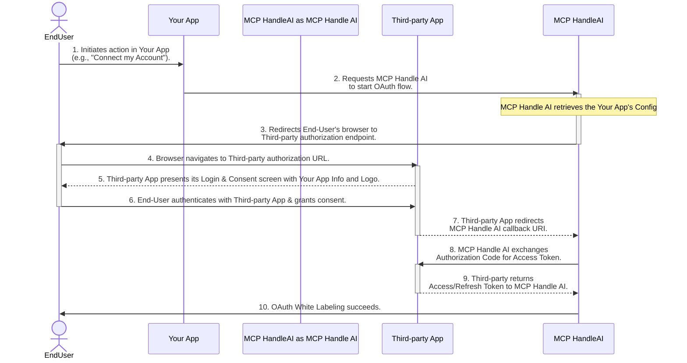

<Tip>
For detailed OAuth scope and how to create your own OAuth app, see our [OAuth knowledge](/knowledge-base/oauth_app/oauth-scopes).
</Tip>

## What is White-label?

White-label allows you to customize the authentication experience with your own branding. When enabled, users will see your application name, logo, and other brand elements during the OAuth flow instead of MCP Handle AI's.

<Frame>
  
</Frame>

## OAuth Flow (w/ white-label)




## Implementation

### Setting Up White-label

To set up white-label for your OAuth integrations:

<Steps>
  <Step title="Register Your Application">
    Register your application with the third-party service (GitHub, Slack, etc.) to obtain your client ID and client secret.
  </Step>
      <Step title="Configure White-label in MCP Handle AI">
    Go to the MCP Handle AI white label configuration page:
    
    [https://www.mcp-handle.dev/home/white-label](https://www.mcp-handle.dev/home/white-label)
    
    <Frame>
      
    </Frame>
    
    <Tip>
      Make sure to add the callback url to your app's OAuth allow list.
    </Tip>
  </Step>
  <Step title="Implement OAuth Authorization">
    Redirect users to the MCP Handle AI OAuth authorization endpoint with your client ID:
    
    <CodeGroup>
    
    ```javascript without SDK
    // Example: Initiating GitHub OAuth with white-label
    const authUrl = `https://api.mcp-handle.dev/oauth/github/authorize?instance_id=${instanceId}&client_id=${yourClientId}`;
    window.location.href = authUrl;
    ```
    
    ```typescript TypeScript SDK
    import { MCP Handle } from "@mcp_handle/sdk";
    
    const mcp_handle = new MCP Handle({
      apiKey: "YOUR_API_KEY"
    });
    
    // Example: Initiating GitHub OAuth with white-label
    const oauthUrl = await mcp_handle.mcpServer.getOAuthUrl({
      serverName: MCP Handle.McpServerName.Github,
      instanceId: instanceId,
      clientId: yourClientId,
      // redirectUri: YOUR_REDIRECT_URI,
      // scope: "YOUR_SCOPES", 
    });
    
    window.location.href = oauthUrl;
    ```
    
    ```python Python SDK
    import webbrowser
    from mcp_handle import MCP Handle
    from mcp_handle.types import McpServerName
    
    mcp_handle = MCP Handle(api_key="YOUR_API_KEY")
    
    # Example: Initiating GitHub OAuth with white-label
    oauth_url = mcp_handle.mcp_server.get_oauth_url(
        server_name=McpServerName.GITHUB,
        instance_id=instance_id,
        client_id=your_client_id,
        # redirect_uri="YOUR_REDIRECT_URI",
        # scope="YOUR_SCOPES"
    )
    
    # Open OAuth URL in user's default browser
    webbrowser.open(oauth_url)
    ```
    
    </CodeGroup>
    
    <Tip>
    You can also specify scope and redirect_url in the authUrl, check the api reference for more details.
    </Tip>
  </Step>
  <Step title="(Optional) Add Your Own Callback URL">
    For simplicity, you can use the default callback URL: https://api.mcp-handle.dev/oauth/{server_name}/callback,
as shown in the previous step. This is the endpoint where we handle user credentials for authentication.

However, some OAuth consent screens (such as GitHub's) display the callback URL to the user. If this URL doesn't match your application's domain, it can appear untrustworthy.

To address this, you can use a callback URL under your own domain and set up a redirect—either via DNS or within your application—that forwards requests to:
https://api.mcp-handle.dev/oauth/{server_name}/callback. Below is an example using FastAPI to simply redirect from your Github oauth application to MCP Handle oauth service in python - 

```python
@app.get("/github/redirect")
async def redirect_to_jira_callback(request: Request):
    target_url = "https://api.mcp-handle.dev/oauth/github/callback"
    
    query_params = request.query_params
    if query_params:
        query_string = str(query_params)
        target_url = f"{target_url}?{query_string}"
        
    return RedirectResponse(url=target_url)
```

  </Step>

</Steps>

For technical assistance with OAuth implementation or white-label, please join our Discord community.
